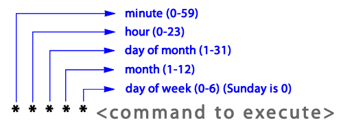

# Using the backup-mongo-to-s3-*.sh Scripts 
___

The purpose of these scripts is to dump the mongo database into a directory, bundle it into a tarball, and send it to a private s3 bucket.

The scripts are named for their respective purposes and can be parameterized at some point if desired.

Each script assumes AWS credentials are accounted for, either by existing in /home/ec2-user/.aws/credentials or by having the ec2 server hold an IAM role with a policy granting it access to the private s3 bucket.

Make sure aws is installed: http://docs.aws.amazon.com/cli/latest/userguide/installing.html

This example will assume the use of the backup-mongo-to-s3-demo.sh script.

### Add the backup-mongo-to-s3-demo.sh script to _/home/ec2-user/scripts_ 

### Open crontab for adding an event
```
$ crontab -e
```

### Vi will open. Insert a schedule into the open file and exit vi using the sequence _:wq_. The following will run the script every day at noon.
```
0 12 * * * /home/ec2-user/scripts/backup-mongo-to-s3-demo.sh
```

A reference for the number placements is below.



### Other useful crontab commands include
```
List cron jobs: $ crontab -l
```

```
Remove cron jobs: $ crontab -r
```

```
View cron output: $ less /var/spool/mail/ec2-user and $ less /var/log/cron
```

### TODO: Email status of cron jobs

### In the event of the need to restore the database, first download the tar file from s3 and transfer it to the machine to be restored on. The database backups are in s3 as follows:
```
PRODUCTION: s3://jivango-private/production/db-bkps
```

```
DEMO: s3://jivango-private/demo/db-bkps
```

```
DEVELOPMENT: s3://jivango-private/development/db-bkps
```

Either download the .tar files locally directly from s3 and use scp to transfer them onto the database server or use the aws cli from the database server.

### On the database server, uncompress the database to be restored.
```
$ tar -zxvf <filename>.tar
```

### On the database server, start a mongo terminal and drop the database being restored to avoid conflicts.
```
$ mongo
```

```
> use jivango-demo
```

```
> db.dropDatabase()
```
    
### On the database server, restore the database. NOTE: Run the command at the same level as the directory containing the database to restore. For example, if the database was uncompressed to /home/ec2-user/db-bkps/2016-jivango-demo/jivango-demo, run the following command from /home/ec2-user/db-dbkps/2016-jivango-demo
```
$ mongorestore --noIndexRestore -d jivango-demo jivango-demo
```

---
